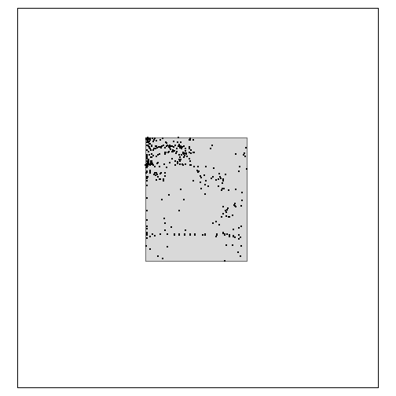

<!-- README.md is generated from README.Rmd. Please edit that file -->


# `envClean`: an R package to help clean large unstructured data set(s)

<!-- badges: start -->
<!-- badges: end -->

The goal of `envClean` is to help clean large, unstructured, biological (or `env`ironmental) data sets.

It assumes the desired end result is a plausible list of taxa recorded at space and time locations for use in further analysis. This is _not the same_ as an authoritative checklist of taxa for any space and time locations.

While there are many implied and explicit decisions to make (e.g. there may be a lot of work to set up for new data sets), there is no manual input required once those decisions are made - these functions have the potential to provide an automated workflow from combined data through to analysis-ready data. Some help with reporting on the cleaning process also included.

## Installation

`envClean` is not on [CRAN](https://CRAN.R-project.org).

You can install the development version from [GitHub](https://github.com/) with:

``` r
# install.packages("devtools")
devtools::install_github("Acanthiza/envClean")
```

Load `envClean`


```r
library("envClean")
```

## Filtering an 'area of interest'

An area of interest, or geographic range, sets the spatial boundary for the cleaning. Adding geographic (or spatial) bins based on a raster that spans the area of interest is another way to achieve the same end.

This example uses the `flor_all` data frame and the simple feature `aoi`. Converting `flor_all` to `sf` allows plotting them together.

Load `flor_all`


```r
flor_all <- tibble::as_tibble(flor_all)
```

Convert `flor_all` to `sf` and plot together with `aoi`.


```r

  flor_all_sf <- flor_all %>%
    sf::st_as_sf(coords = c("long", "lat")
                 , crs = 4326
                 )

  tmap::tm_shape(aoi
           , bbox = sf::st_bbox(flor_all_sf)
           ) +
    tmap::tm_polygons() +
  tmap::tm_shape(flor_all_sf) +
    tmap::tm_dots()
```

<div class="figure">

<p class="caption">Records from `flor_all` plotted over the area of interest `aoi`.</p>
</div>

Filtering `flor_all` to `aoi` is done with `filter_geo_range`.


```r

  flor_aoi <- filter_geo_range(flor_all
                         , use_aoi = aoi
                         ) %>%
    envFunc::add_time_stamp()
#> Joining with `by = join_by(long, lat)`

  flor_aoi
#> # A tibble: 1,419 × 10
#>     long   lat      area data_name site       date       original_name          rel_metres month  year
#>    <dbl> <dbl>     <dbl> <fct>     <chr>      <date>     <chr>                       <dbl> <dbl> <dbl>
#>  1  140. -34.5 81695918. GBIF      2573957849 2020-02-22 Eremophila glabra             500     2  2020
#>  2  140. -34.5 81695918. GBIF      3902768443 2022-08-14 Triodia scariosa               NA     8  2022
#>  3  140. -34.5 81695918. GBIF      3902326597 2022-08-14 Beyeria lechenaultii           NA     8  2022
#>  4  140. -34.5 81695918. GBIF      3902042262 2022-08-14 Walsholaria magniflora         NA     8  2022
#>  5  140. -34.5 81695918. GBIF      3058875475 2019-09-01 Triodia scariosa              564     9  2019
#>  6  140. -34.5 81695918. GBIF      3058756300 2019-09-01 Westringia rigida             564     9  2019
#>  7  140. -34.5 81695918. GBIF      3902151141 2022-08-14 Phebalium bullatum             NA     8  2022
#>  8  140. -34.5 81695918. GBIF      3902634058 2022-08-14 Acacia rigens                  NA     8  2022
#>  9  140. -34.5 81695918. GBIF      3902018286 2022-08-14 Exocarpos aphyllus             NA     8  2022
#> 10  140. -34.5 81695918. GBIF      3923355578 2022-08-14 Maireana radiata               NA     8  2022
#> # ℹ 1,409 more rows
```

Check that spatial filter worked.


```r

  flor_aoi_sf <- flor_aoi %>%
    sf::st_as_sf(coords = c("long", "lat")
                 , crs = 4326
                 )

  tmap::tm_shape(aoi
           , bbox = sf::st_bbox(flor_all_sf)
           ) +
    tmap::tm_polygons() +
  tmap::tm_shape(flor_aoi_sf) +
    tmap::tm_dots()
```

<div class="figure">

<p class="caption">plot of chunk flor_aoi</p>
</div>

## What else is in `envClean`

The following functions and data sets are provided in `envClean`. See https://acanthiza.github.io/envClean/ for more examples.


|object                            |class                      |description                                                                   |
|:---------------------------------|:--------------------------|:-----------------------------------------------------------------------------|
|`envClean::add_cover()`           |function                   |Generate best guess of cover for each taxa*context                            |
|`envClean::add_height()`          |function                   |Generate best guess of height for each taxa*context                           |
|`envClean::add_lifeform()`        |function                   |Generate best guess of lifeform for each taxa*context                         |
|`envClean::aoi`                   |sf and data.frame          |Simple feature to define a geographic area of interest.                       |
|`envClean::bin_taxa()`            |function                   |Add code{taxa} column                                                         |
|`envClean::cleaning_summary()`    |function                   |Describte change in taxa, records, visits and sites between cleaning steps    |
|`envClean::cleaning_text()`       |function                   |Write a sentence describing change in taxa, records, visits and sites between |
|`envClean::filter_counts()`       |function                   |Filter any context with less instances than a threshold value                 |
|`envClean::filter_geo_range()`    |function                   |Filter a dataframe with e/n or lat/long to an area of interest polygon (sf)   |
|`envClean::filter_prop()`         |function                   |Filter taxa recorded at less than x percent of visits                         |
|`envClean::filter_taxa()`         |function                   |Clean/Tidy to one row per taxa*Visit                                          |
|`envClean::filter_text_col()`     |function                   |Filter a dataframe column on character string(s)                              |
|`envClean::find_outliers()`       |function                   |Find local outliers                                                           |
|`envClean::find_taxa()`           |function                   |Find how taxa changed through the cleaning/filtering/tidying process          |
|`envClean::flor_all`              |tbl_df, tbl and data.frame |Example of data combined from several data sources.                           |
|`envClean::get_taxonomy()`        |function                   |Get GBIF backbone taxonomy                                                    |
|`envClean::luclean`               |tbl_df, tbl and data.frame |Dataframe of cleaning steps                                                   |
|`envClean::lurank`                |tbl_df, tbl and data.frame |Dataframe of taxonomic ranks                                                  |
|`envClean::make_attribute()`      |function                   |Title                                                                         |
|`envClean::make_con_status()`     |function                   |Make conservation status from existing status codes                           |
|`envClean::make_cover()`          |function                   |Make a single (numeric, proportion) cover column from different sorts of      |
|`envClean::make_effort_mod()`     |function                   |Distribution of credible values for taxa richness.                            |
|`envClean::make_effort_mod_pca()` |function                   |Model the effect of principal components axes on taxa richness.               |
|`envClean::make_env_pca()`        |function                   |Principal components analysis and various outputs from environmental data     |
|`envClean::make_gbif_taxonomy()`  |function                   |Make taxonomy lookups                                                         |
|`envClean::make_ind_status()`     |function                   |Make indigenous status lookup                                                 |
|`envClean::make_lifeform()`       |function                   |Get unique lifeform across taxa, perhaps including further context            |
|`envClean::make_taxonomy()`       |function                   |Get taxonomy via code{galah::taxa_search()}                                   |
|`envClean::rec_vis_sit_tax()`     |function                   |How many records, visits, sites and taxa in a dataframe                       |
|`envClean::reduce_geo_rel()`      |function                   |Reduce data frame to a single spatial reliability within a context            |
|`envClean::taxonomy_fixes`        |tbl_df, tbl and data.frame |Manual taxonomic fixes                                                        |
|`envClean::taxonomy_overrides`    |tbl_df, tbl and data.frame |Manual taxonomic overrides                                                    |


