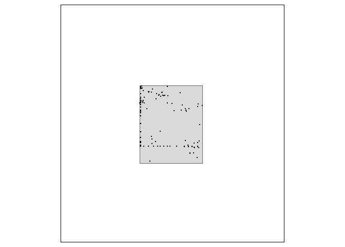

<!-- README.md is generated from README.Rmd. Please edit that file -->


# `envClean`: an R package to help clean large unstructured data set(s)

<!-- badges: start -->
<!-- badges: end -->

The goal of `envClean` is to help clean large, unstructured, biological (or `env`ironmental) data sets.

It assumes the desired end result is a plausible list of taxa recorded at space and time locations for use in further analysis. This is _not the same_ as an authoritative checklist of taxa for any space and time locations.

While there are many implied and explicit decisions to make (e.g. there may be a lot of work to set up for new data sets), there is no manual input required once those decisions are made - these functions have the potential to provide an automated workflow from combined data through to analysis-ready data.

## Installation

`envClean` is not on [CRAN](https://CRAN.R-project.org).

You can install the development version from [GitHub](https://github.com/) with:

``` r
# install.packages("devtools")
devtools::install_github("Acanthiza/envClean")
```

Load `envClean`


```r
library("envClean")
```

## Filtering an 'area of interest'

This example uses the `flor_all` data frame and the simple feature `aoi`. Converting `flor_all` to `sf` allows plotting them together.

Load `flor_all`


```r
flor_all <- tibble::as_tibble(flor_all)
```

Convert `flor_all` to `sf` and plot together with `aoi`.


```r

  flor_all_sf <- flor_all %>%
    sf::st_as_sf(coords = c("long", "lat")
                 , crs = 4326
                 )

  tmap::tm_shape(aoi
           , bbox = sf::st_bbox(flor_all_sf)
           ) +
    tmap::tm_polygons() +
  tmap::tm_shape(flor_all_sf) +
    tmap::tm_dots()
```


Filtering `flor_all` to `aoi` is done with `filter_aoi`.


```r

  flor_aoi <- filter_aoi(flor_all
                         , use_aoi = aoi
                         , crs_aoi = sf::st_crs(aoi)
                         ) %>%
    envFunc::add_time_stamp()
#> Joining, by = c("lat", "long")

  flor_aoi
#> # A tibble: 3,396 x 13
#>      lat  long data_name site      date       original_name             cover cover_code quad_x quad_y rel_dist month  year
#>    <dbl> <dbl> <chr>     <chr>     <date>     <chr>                     <int> <chr>       <int>  <int>    <dbl> <int> <int>
#>  1 -34.6  140. BDBSA     216       1990-07-12 Eucalyptus gracilis          NA "2"            30     30      100     7  1990
#>  2 -34.6  140. BDBSA     216       1990-07-12 Eucalyptus oleosa (NC)       NA "2"            30     30      100     7  1990
#>  3 -34.6  140. BDBSA     216       1990-07-12 Brassica tournefortii        NA "T"            30     30      100     7  1990
#>  4 -34.6  140. BDBSA     216       1990-07-12 Beyeria opaca                NA "T"            30     30      100     7  1990
#>  5 -34.6  140. BDBSA     216       1990-07-12 Eucalyptus socialis (NC)     NA "T"            30     30      100     7  1990
#>  6 -34.6  140. BDBSA     216       1990-07-12 Eucalyptus brachycalyx       NA "1"            30     30      100     7  1990
#>  7 -34.6  140. BDBSA     216       1990-07-12 Myoporum platycarpum (NC)    NA "T"            30     30      100     7  1990
#>  8 -34.6  140. BDBSA     216       1990-07-12 Eucalyptus dumosa            NA "1"            30     30      100     7  1990
#>  9 -34.6  140. BDBSA     216       1990-07-12 Melaleuca lanceolata         NA "T"            30     30      100     7  1990
#> 10 -34.6  140. EGIS      SUP2006-2 1990-07-12 Eucalyptus gracilis          NA ""             NA     NA      100     7  1990
#> # ... with 3,386 more rows
```

Check that spatial filter worked.


```r

  flor_aoi_sf <- flor_aoi %>%
    sf::st_as_sf(coords = c("long", "lat")
                 , crs = 4326
                 )

  tmap::tm_shape(aoi
           , bbox = sf::st_bbox(flor_all_sf)
           ) +
    tmap::tm_polygons() +
  tmap::tm_shape(flor_aoi_sf) +
    tmap::tm_dots()
```



## What else is in `envClean`

The following functions and data sets are provided in `envClean`. See https://acanthiza.github.io/envClean/ for more examples.


```
#> Error: Problem with `mutate()` column `class`.
#> i `class = purrr::map_chr(object, ~envFunc::vec_to_sentence(class(get(.))))`.
#> x lazy-load database 'C:/Users/nwilloughby/Documents/R/win-library/4.0/envClean/R/envClean.rdb' is corrupt
#> Error in knitr::kable(manuals[, 2:4]): object 'manuals' not found
```


